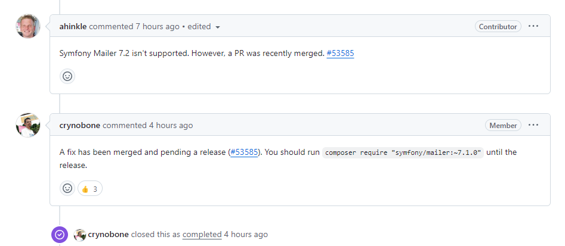

# Hello Container Laravel Assessment

## The assessment

Hello developer,  
What we would like you to build, is a notification we want to add to our platform for when a customer gives us the 'go' to release a "bill of lading" (document about the freight also used to prove ownership of the freight) to the consignee (receiving party), which uses one of our contracts (they could be using their own).
If this is the case, we must make sure the freight invoice is paid, otherwise the carrier won't give us the bill of
lading.

To simplify it for you and remove the necessity of sending you our entire project, you can assume the following:

-   Start with a fresh Laravel 10 project, with the default scaffolding which should include the User model.
-   Add a model named 'Order' with at least:
    -   'id' (auto increment)
    -   'bl_release_date' (datetime)
    -   'bl_release_user_id' (int)
    -   'freight_payer_self' (bool/tinyint)
    -   'contract_number' (string)
    -   'bl_number' (string)
-   Create a notification named 'PaymentRequest' and implement a toMail function to have it send an email to a fixed mail address (mine or your own for testing) including at least all the Order properties listed above.
-   Use an event handler to check if an Order was saved where freight_payer_self = false (meaning it is our contract, the customer itself it not the freight payer) and make it so it fires only once and then queue the 'PaymentRequest' notification.
-   Create a unit test or test route and controller to trigger the event handler mentioned above. This last step won't be needed in the actual system so it can be quick & dirty.
-   Then send me a Github or Bitbucket repository link or a zip file with the code created.

There is no hard time limit now, but this is a typical story we are currently building all the time, so once you're up to speed it should be possible to build something like this within a few hours.

Building this should give you a good idea of what we are asking of you and it should give us a good impression of your skills.

Please keep me informed about your planning and progress (or problems) and feel free to ask for help if you get stuck or need some clarification. Good luck!

## The solution

Run the docker, configure it and go to [the webserver](http://localhost/orders).

### Configure and run
Run the following commands to configure the app;
```shell
composer install

php artisan migrate

cp .env.example .env
# change `MAIL_MAILER=log` to `MAIL_MAILER=smtp`
# and `MAIL_HOST=127.0.0.1` to `MAIL_HOST=mailpit`
# and `MAIL_PORT=2525` to `MAIL_PORT=1025`

chmod a+rw -R . 

php artisan key:generate

php artisan db:seed --class=OrderSeeder
```

[Send a test mail](http://localhost/send-test-email) to verify the mail settings, it will send an email to the mailpit system and that can be reviewed at the [mailPit Docker](http://localhost:8025/).

Go to [Order Overview](http://localhost/orders), each table row is clickable.
When you click on a row with Notified `No` and Freight payer `self`, you will be forwarder to the order information page.
You will be able to send the notification, otherwise you will see a message that the notification is already sent.


## Time registration

How long did it take me to develop this project. Hopefully this transparency doesn't work against me. First I had to do some research, since I've never worked on a Laravel project.

|    Day     | Duration in hours | Description                                                    |
| :--------: | ----------------: | :------------------------------------------------------------- |
|            |                   | **Research**                                                   |
| 2024-11-27 |                 2 | Create Laravel in Docker                                       |
| 2024-11-28 |                 1 | Bug fix installation on windows Docker                         |
| 2024-11-28 |              0.25 | Build migration Order                                          |
| 2024-11-28 |                 1 | Build overview/table and fix failing migration (cache issue ?) |
| 2024-11-29 |              0.25 | Mail notifier                                                  |
| 2024-11-29 |              0.25 | Eventlisterner + planning                                      |
| 2024-11-29 |                 1 | blade template + routes                                        |
| 2024-11-29 |               0.5 | Event + handler                                                |
|            |                   | **Development**                                                |
| 2024-11-30 |                 1 | Setup new laravel development project with Github repository   |
| 2024-11-30 |               1.5 | Create a Pest/PHPUnit test for the event                       |
| 2024-11-30 |                 1 | Dispatch the event                                             |
| 2024-12-01 |               0.5 | Failing event dispatcher                                       |
| 2024-12-01 |                 3 | Troubleshoot mail bug                                          |
| 2024-12-01 |                 1 | Cleanup test files                                             |
| 2024-12-01 |                 1 | Update templates                                               |
| 2024-12-03 |                 2 | Send notifications only once                                   |
| 2024-12-03 |              0.25 | Welcome page                                                   |
| 2024-12-03 |               0.5 | Write documentation                                            |

## Issues

The Laravel site only showed me how to create a new Laravel 11 project, so due to the limitted time I've decided to use this instead of the required version 10.

I've noticed the default CSS-framework in Laravel is Tailwind. However, for the same reaseon as decribed above I added the Bootstrap-framework.

Apperently Mailpit is a development tool for catching / testing mail. I'll be using this to validate the sending of mails, instead figuring out how to configure Laravel mail settings.

Spend a very long time debugging this error:
`The "" scheme is not supported; supported schemes for mailer "smtp" are: "smtp", "smtps".`
Eventually I allmost give up on this assessment, untill I stumbled on this bug-report:
[Laravel 11 with symfony/mailer v7.2.0 - UnsupportedSchemeException for SMTP configuration](https://github.com/laravel/framework/issues/53721)

It seems to be a bug, and was easily fixed by manually downgrading one off the dependancies:
`composer require "symfony/mailer:~7.1.0"`


Did not use the Assets-system, but include them hard coded. For a real project I would research how to use this system.

## Helpfull commands

To run commands in the docker-app:

```shell
docker exec -it hello-assessment-laravel.test-1 bash
```

```shell
php artisan migrate:rollback
php artisan migrate:refresh

php artisan db:seed --class=OrderSeeder

php artisan make:test OrderTest --unit

chmod a+rw -R ./

php artisan test

php artisan config:cache
php artisan config:clear

php artisan cache:clear
```
